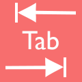

# WELCOME TO TABIT! #

### What is TabIt! ###

TabIt is a Chrome Extension offering a new and beautiful way of managing your todo's.

### How Does it Work? ###

Glad you asked!  It's simple, just add the extension from the Google Chrome Extension Store and then open a new tab in your browser.

You'll then be prompted to signin. This process is easy and painless. TabIt just uses the Chrome [OAuth API(https://developer.chrome.com/apps/app_identity), specifically accessing your gmail to authenticate you as a user. Once that's done you'll be prompted to write your first todo. Once you've "Tabbed It" your window will display a nice looking todo item. Your title tab for the window will also display the todo item making it easy to see what todos you still have open.

Once your done with a todo, it's even easier. Just click the "completed" button and the todo is gone forever, and congratulations will be in order.

## Open Source ##

This project is very much open source, and we welcome anyone interested in contributing to do so.

### Contribute ###

1. Fork the repository.
2. Clone the repository to your local environment.
3. Create an issue suggestion what you'd like to contribute.
  1. We will review and get back to you asap.
4. Once your done making changes create a pull request.
  1. Again, we will review asap.
5. A big thanks to you!
